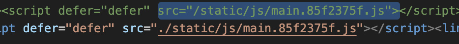
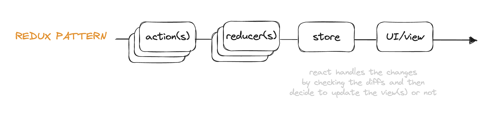
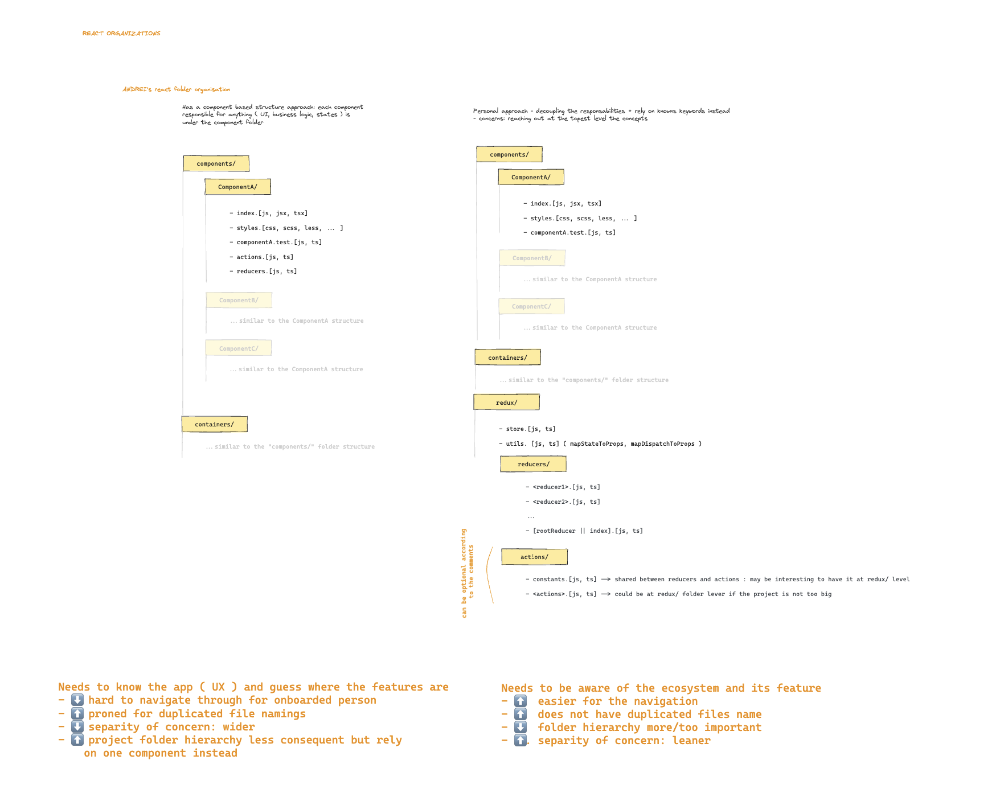

# Seen doing these exercise

## Installation
project creation
- `npx create-react-app <project-name>`

project installation
-`npm install`

## Component props
`props` are what a component child receive from its parent ( the component
that invoked it ).
In order to initiate a child component to be aware of the parent's data passed down,
such as object inheritance concerns, we need to tell the extended React.Component to subscribe to the props received from the parent.

```jsx
// initials a class based component with props
class MyComponent extends Component
	constructor(props){
		// assign inherited props to this component
		super(props)
	}
	render(){
		return(
			<JSX>
		)
	}
```

### Passing props in react  ( from the current parent component definition )
When instanciating a component (which is a child of the current component),   
passing props to this component is like "creating an attribute to an html element"
```jsx

/**
 * ... Within JSX
 * Passing the props user having the value someone
 */
<MyComponent myProps = {user: 'someone'} />
```

### Reading the props in react ( from the child component )
```jsx
/** 
 * ...
*  Reading the props content
*/
console.log('this.props:', this.props); // { user, children }
console.log('this.props.user:', this.props.user); // "someone"
```


## State and update
- `this.state` representing the state of a component that 
need to be declared within the class based component constructor.
Note: a component with a state is a stateful component ( a commenting with the state logic )

```jsx
// initial state in class based component
class MyComponent extends Component
	constructor(){
		this.state = {
			<property>: <value>
		}
	}
	render(){
		return(
			<JSX>
		)
	}
```

```jsx
// update a class bases component state () - 
this.setState({
	// (optional) update the entire state by restoring the previous state
	...this.state, 

	// updates the concerned property
	<property>: <value>
})
```

### Hosting inner project react
- at the react project level
	- src/public/index.html {PUBLIC_PATH} should be a relative path
	- then run `npm run build`
	- then in the `build/index.html` put relative path by
	 prepending `.` before the path separator
	 


--------------

# REACT HOOKS
Once the component based approach has been done,
the practice is to convert the current code with hooks ( react 16.8+ )
Hooks are mainly function and provide the ability to reuse/share state logic between 
component alongside more feature.
The motivation: 
https://legacy.reactjs.org/docs/hooks-intro.html#motivation
- hard to reuse logic between compgponent
- hard to maintain large component - not readable anymore
- class confuses both developers and machines

## "Robot friends project"
1. Must get back the robot friends project
2. Must transform the app: component based to functional based with hooks
### Cloned repo: issues encountered - installation related: 
- SCSS
After cloning the repo + installing the project: had quite a lot of issue 
as the project uses scs:
 - create-react-app used to install node-sass which is nowadays deprecated / install node
 ( see #Solution section bellow )

- ReportWebVitals:
Just remove the web vitals and you are good ( as we did not dived into its functionalities )

#### Solution
In order to get scss feature - we need to :
https://create-react-app.dev/docs/adding-a-sass-stylesheet/
- uninstall `node-sass`: `npm uninstall node-sass`
- install `sass` instead : `npm i sass --save-dev`
Then there are no more scss issues


-----------

REACT AND REDUX

### Conceptions steps 

Conception steps to follow
- **action(s)**: a client action triggering an action creator for the reducer(s)  
	concerned to handle === Dispatching an action
	- **action creators** : a function that returns the content of the action
	```js
	// example: action creator returning an action composed of a type and the value to pass
	function setUser( user ){ // user = string value

		// naming convention : action
		return {
			type: "SET_USER",	// action.type
			payload: { user }	// action.payload.user
		}
	}
	```
- **reducer(s)**: a function having as sole responsibility to update a part of 
the unique source of truth, the unique state management object : *the store*.
A function having as parameters *the state, and the action*
```js
	function reducerX ( state = {}, action ){
		const { type } = action;
		switch( type ){
			case 'SET_USER':
				return {
					...state,   // eq. Object.assign({}, state) to avoid mutating the state directly
					user
				}
			case default:
				return state;

		}

	}
```


- **the store**: an object computation representing and containing the whole application state,
when it changes, react handles the diff to update the correct subscribed UI/view
- the UI/views: the component that need to update
see [the store.js](../04_redux-with-robotfriends-app-like/src/redux/store.js)


#### CONTEXT 
- add redux to avoid having heavy states logic in component
- add redux-thunk to consume the redux and handle asynchronicity:
here this will relate to fetching the list of friends

Once both are installed, setup, we could remove safely every
data oriented concerned states to only consume redux and redux-thunk
for the business logic


##### PREP THE CONSUMABLE

1. create one action file ( or the one you need )
	- this would list `action creators`: functions dispatching an action type and may includes a payload

2. create a `store`: 
	- this will represent your application whole state
		- it can have multiple decoupled reducers that will be merged together
		- it can also represent only one reducer

3. create a `reducer` file
	- for a same concern of your application, create a file containing a function that is receiving a state, and an action.
	Set the default state to an `initialState` object.
	The within logic would be a switch case relying on a given argument's property `action.type` ( action type === action name ).
	According to the type, the switch case will proceed to a computation in order to 
	modify the state for the store to get updated.


##### PLUG REDUX AND THE STORE TO THE APP
In `index.js`
4. import your exported `reducer`
5. import `{ createStore, combineReducers } from 'redux'`
	to create a store `const store = createStore(<reducer>)`
6. import the `{ Provider } from 'react-redux'`
	to pass down the store to the application
	Then wrap the App component with the `<Provider store={store}> ... </Provider`
	to pass down the store to the whole app.

In `App.jsx`
7. import `{ connect } from 'react-redux'`
8. create 2 functions: 
	- `mapStateToProps` : 
	```js
	const mapStateToProps = state => ({ searchfield: state.searchfield })
	```
	- `mapDispatchToProps`: 
	```js
	const mapDispatchToProps = dispatch => (
		{ onSearchChangeEffect: e => dispatch(
			{ type: '<TYPE>', payload: <PAYLOAD VALUE> }
		)}
	)
	```
9. connect redux and its store to the react app:
At the end of the app file when exporting the component, 
we will use the High Order Function ( a function returning a function
(this function being the component App ))
`export default connect(mapStateToProps, mapDispatchToProps)(App);`


### Structures with react and redux
