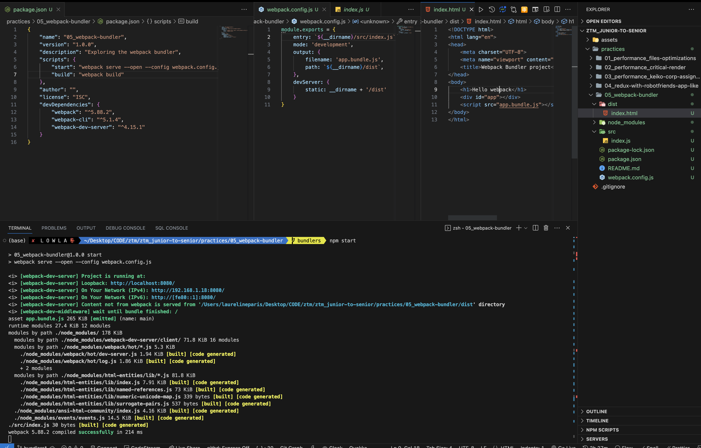
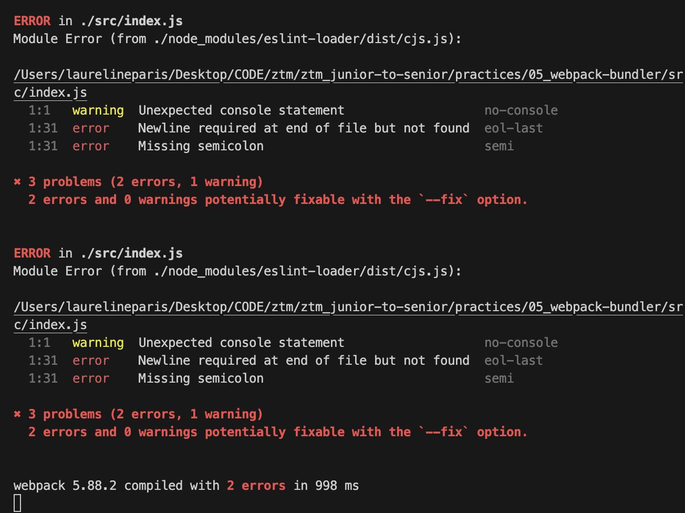

# Bundlers
(Module) Bundlers are tools to handle:
- compilations
- files reduction
- files optimizations and obfuscations

## Tools / Packages
- webpack: for big projects + heavily customable config.
- parcel: for small projects + fast and easy to config.
- rollup: good for packages creations
- vite, snowpack ...

## Webpack and Babel Configurations
### Install babel tools
- `npm install @babel/core babel-loader @babel/preset-env --save-dev` (current version)
	- `npm install babel-core babel-loader babel-preset-env --save-dev` ( shown - deprecated )
		- babel-core: tool to compile 
		- babel-loader: compiles files
		- babel-preset-env: changes code for browser that does not support the code
			- can pick various packages `babel-preset-stage-<n>`

### Webpack config file
Entry points 
	- html file (dist/index.html)
		- add a `div` and a `script file` for the js file entry point referenced
	- js file (index.js) - automatically generated out from your files
	

- Configuration: 
		https://webpack.js.org/guides/getting-started/

	- create a `webpack.config.js` file
	- add the environment mode: `"mode":"development"`
	- add the entry point: `"entry": "./src/index.js"`
	- add the output point: ```"entry": "`${__dirname}/dist/app.bundle.js`"```
	- add the development server to launch the app: ```"devServer": { static: `${__dirname}/dist` },```
		- note: ```"devServer": {"contentBase": `${__dirname}/dist` }``` is not used anymore
	- add babel module rules ( module.rules ):
	```js
	{
		"rules": [
				{
					test: /\.(js|jsx)$/,
					exclude: ['/node_modules/'],
					use: ['babel-loader'],
				},
			],
		}
	```
	-


### `package.json` and Babel Configurations
- within the `package.json`
```json
	"babel": {
		"presets": [
			// "env",	// not used anymore
			"@loader/preset-env",
			// "react" 	// not used anymore
			"@loader/preset-react"


		]
	},
```


## Installing projects libraries
### Installing react
- `npm install react react-dom`
- in `webpack.config.js`: make sure the correct extension   
( jsx | tsx ) are mentioned for the module.rules checking js files


## Installing Formatting Tool (Eslint)
This is a tool that allows to keep a consistent (js) code
- `npm install eslint --save-dev`
*Note: had to upgrade `eslint` version to `"^8.0.0"`*

### Installing `babel-eslint`
In order to handle last js features compilations
- `npm install @babel/eslint-parser`
- create an `.eslintrc.json` file
- add in the file the configurations
See [eslint rules references](https://eslint.org/docs/latest/rules/) for all the list of possible rules
```json
// .eslintrc file
{
	"parser": "@babel/eslint-parser",
	"rules": {
		// warning message when a console is seen in the js|jsx files
		"no-console": "warn",


		// Extras added according to how I code
		"semi": "warn",
		"no-mixed-spaces-and-tabs": 1,
		"indent": [
			2,
			"tab"
		],
		"no-tabs": 0,
		"single": "WARN"
	}
}
```


### Installing existing Eslint flavored rules
Here we will install airbnb eslint rules - their good js practices
but also the accessibility eslint rules
- [Airbnb/JavaScript](https://github.com/airbnb/javascript)
- [a11y accessibility](https://github.com/jsx-eslint/eslint-plugin-jsx-a11y)
#### Installation and configurations
- `npm install eslint-config-airbnb eslint-plugin-jsx-a11y --save-dev`
- in `.eslintrc.json` add 
```json
"extends": ["airbnb-base"]
```

which would finally give the following:
```json
// .eslintrc file
{
	"parser": "@babel/eslint-parser",
	// adding airbnb-base eslint rules ( includes their best practice )
	"extends": [
		"airbnb-base"
	],
	"rules": {
		// warning message when a console is seen in the js|jsx files
		"no-console": "warn",


		// Extras added according to how I code
		"semi": "warn",
		"no-mixed-spaces-and-tabs": 1,
		"indent": [
			2,
			"tab"
		],
		"no-tabs": 0,
		"single": "WARN",
		"import/no-extraneous-dependencies": [
			"error",
			{
				"dependencies": false,
				"devDependencies": false,
				"optionalDependencies": false,
				"peerDependencies": false
			}
		]
	}
}
```

Running the command we can observe more errors as we added the js flavor of airbnb



# [ Webpack, Parcel, Snowpack ] A Webpack Configurator
*"Createapp.dev"*: allows you to generate a bundler config ( includes webpack )
based on the widely used stack of your project
https://createapp.dev/webpack/react--babel--jest--react-hot-loader--sass--typescript

# Eslint
This tools - and its complementary webpack plugins - is here to ensure
the one write js in a certain way and ensure the codebase homogeneity


## Errors
---- 
- Error related to "cannot find babel-preset-env" or "babel-preset-react"

Cause:
```json
"babel": {
	"presets": [
		"env",
		"react"
	]
},
```
Solution: 
```json
"babel": {
	"presets": [
		"@babel/preset-env",
		"@babel/preset-react"
	]
},
```

---- 

- Error: Webpack showing several times the errors
Cause: the configuration had a duplicated same `module.rules.<rule>`
Solution: remove the duplicated `module.rules.<rule>`

----- 
- Error: eslint-loader package deprecated  
Cause: package deprecation message when installing using "npm install" or installing the package itself
Solution: eslint-webpack-plugin package
- `npm install -D eslint-webpack-plugin`
- modify `webpack.config.js`
```js
const {ESLintPlugin} = require('eslint-webpack-plugin');
{
	// ...
	plugins: [new ESLintPlugin()]
}
```

----
- Error: webpack.config.js file import ESLintPlugin linting 
Cause: probably an inner rule prevent regarding import
Solution:
```json
// .eslintrc
{
	// ...
	"import/no-extraneous-dependencies": [
		"error",
		{
			"dependencies": false,
			"devDependencies": false,
			"optionalDependencies": false,
			"peerDependencies": false
		}
	]
}
```
---